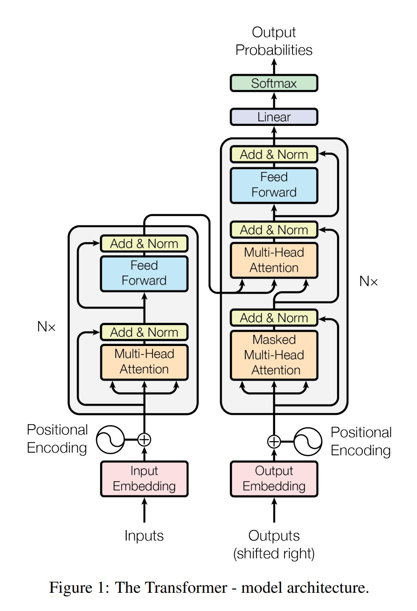

# vlm-from-scratch

A hands-on exercise building a transformer/VLM from scratch, following Umar Jamil's [YouTube series](https://www.youtube.com/@umarjamilai) and [diagrams](https://github.com/hkproj/transformer-from-scratch-notes/blob/main/Diagrams_V2.pdf).

**Attention Is All You Need** [arxiv](https://arxiv.org/abs/1706.03762), [pdf](https://arxiv.org/pdf/1706.03762)

## Architecture




Token IDs → embeddings + sinusoidal positional encoding → multi-head self-attention (encoder) → cross-attention + causal self-attention (decoder) → linear head over vocab. Standard encoder-decoder transformer, built layer by layer with no `torch.nn.Transformer` shortcuts.

## What's implemented

* `attention.py` — single-head and multi-head scaled dot-product attention, with masking support
* `embeddings.py` — token embeddings + sinusoidal positional encoding
* `transformer.py` — full encoder-decoder transformer: `FF`, `EncLayer`/`Encoder`, `DecLayer` (masked self-attn + cross-attn + FFN) / `Decoder`, `Transformer` (causal masking via a registered buffer)
* `test_trans.py` — from-scratch character-level tokenizer (ASCII + BOS/EOS/PAD) and a full training/eval loop (mini-batching, per-epoch shuffling, teacher forcing)

## Verified

* Causality: perturbing a future token in the decoder input leaves earlier outputs unchanged (confirms the causal mask is wired correctly)
* Training: the transformer overfits a toy character-level string-reversal task, reaching 97%+ decode accuracy — proves the from-scratch build trains end-to-end

## Run

```
python test_trans.py
```
