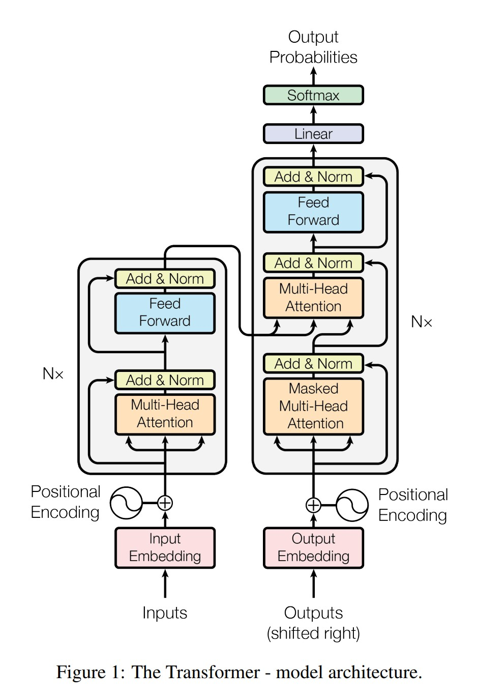

# vlm-from-scratch

A hands-on exersize building a transformer, a ViT, and a small VLM entirely from scratch — no `torch.nn.Transformer`, no pretrained backbones. Following Umar Jamil's [YouTube series](https://www.youtube.com/@umarjamilai) and [diagrams](https://github.com/hkproj/transformer-from-scratch-notes/blob/main/Diagrams_V2.pdf) for the transformer/VLM core, plus the ViT and PaliGemma papers directly for the vision and fusion pieces.

**References:**
* Attention Is All You Need [arxiv](https://arxiv.org/abs/1706.03762), [pdf](https://arxiv.org/pdf/1706.03762)
* An Image is Worth 16x16 Words: Transformers for Image Recognition at Scale (ViT) [arxiv](https://arxiv.org/abs/2010.11929)
* PaliGemma: A versatile 3B VLM for transfer [arxiv](https://arxiv.org/pdf/2407.07726)

## Architecture



Three things are built here, layered on the same core attention/transformer primitives:

1. **Text transformer** — token IDs → embeddings + sinusoidal positional encoding → encoder-decoder transformer with causal (decoder self-attention) + cross-attention masking → linear head over vocab.
2. **ViT (Vision Transformer)** — image → non-overlapping patches → linear projection + learned 2D positional encoding (+ CLS token) → the same `Encoder` stack → classification head.
3. **VLM (PaliGemma-style fusion)** — vision patch embeddings (no CLS) get linearly projected into the text embedding space, concatenated with the text embeddings as a prefix, and passed through **one shared decoder-only `Encoder` stack** — a prefix-LM: the image+prompt region attends bidirectionally, the answer region is causally masked and generated autoregressively. No separate cross-attention module — fusion happens by token concatenation and masking, not by a dedicated fusion architecture.

## What's implemented

* `attention.py` — single-head and multi-head scaled dot-product attention, with masking support
* `text_embeddings.py` — token embeddings, sinusoidal positional encoding, and a from-scratch ASCII tokenizer (BOS/EOS/PAD)
* `transformer.py` — full encoder-decoder transformer: `FF`, `EncLayer`/`Encoder`, `DecLayer` (masked self-attn + cross-attn + FFN) / `Decoder`, `Transformer` (causal masking via a registered buffer)
* `test_text_transformer.py` — training/eval loop for the text transformer (mini-batching, per-epoch shuffling, teacher forcing)
* `vision_embeddings.py` — patch embedding (`unfold`-based, no conv shortcut), learned 2D positional encoding with bicubic interpolation for resolution changes, optional CLS token
* `vit.py` — `VisionEncoder`: patch embeddings → `Encoder` → CLS-token classification head
* `test_vit.py` — trains the ViT to classify real MNIST digits
* `vlm.py` — `VisionProjection` + `VisionModel` (vision tower), `VLM` (fusion class: `forward()` for teacher-forced training/eval, `generate()` for real autoregressive inference — no KV-cache yet, deliberately deferred as a documented TODO)
* `test_vlm.py` — builds a toy image→color-name dataset, trains the VLM, and evaluates it both ways (teacher-forced and true generation)

## Verified

* **Text transformer** — causality (perturbing a future decoder token leaves earlier outputs unchanged) and training (97%+ decode accuracy overfitting a toy string-reversal task)
* **ViT** — trained on real MNIST, reaches 0.95 eval accuracy in 8 epochs — proves the patch-embedding + attention pipeline is wired correctly, not just shape-checked
* **VLM — trained and proven to actually generate, not just predict during training:**
  * Trains to 100% teacher-forced accuracy on a toy image→color-name task
  * **Genuine autoregressive generation** (`VLM.generate()` — the model's own predictions fed back in, no ground truth given at inference) correctly names colors from images alone in most cases
  * **Image-ablation tests confirm the vision tower actually drives the output**, not a language-modeling shortcut: a deliberately adversarial test (feeding the same wrong fixed answer for every image) still produced the correct *first* predicted character per image every time — proof the prediction depends on the picture, not on fed text, matching exactly what the causal-mask design predicts (only the completion, which the fed wrong answer contaminates, drifts)
  * On out-of-distribution images (random noise, an untrained color), the model consistently defaults to its most common trained label rather than producing garbage — a sane, non-catastrophic failure mode
  * A real, documented limitation, kept rather than hidden: teacher-forced training accuracy hit 100%, but free-running generation can still drop a character on an unseen combination — a live, reproducible example of **exposure bias** (training conditions on ground truth, generation conditions on the model's own possibly-imperfect output)

## Run

```
python test_text_transformer.py
python test_vit.py
python test_vlm.py
```
